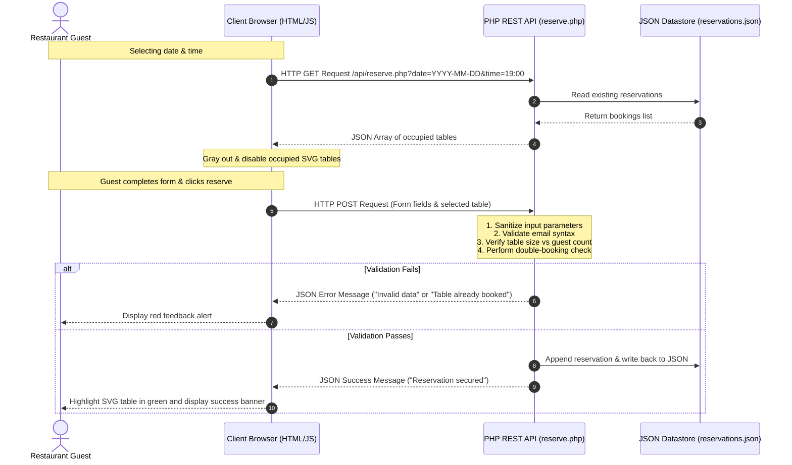

# Website Project Proposal: L'Étoile — Modern Parisian Gastronomy & Lounge

* **Project Title:** L'Étoile Website & Real-Time Seating Booking Engine
* **Client / Subject:** L'Étoile Restaurant (Paris, France)
* **Academic Level:** University Web Design & Development Assessment Standards
* **Development Stack:** HTML5, CSS3, JavaScript (ES6+), jQuery, AJAX, PHP, JSON Datastores

---

## 1. Executive Summary

**L'Étoile** is an upscale, modern Parisian gastronomy restaurant and lounge that blends classic culinary heritage with avant-garde French cooking techniques. In the premium hospitality sector, a restaurant's digital presence must reflect its physical sophistication, prestige, and attention to detail. 

This proposal outlines the design and implementation of a premium, fully responsive, 5-page web application for L'Étoile. The website is engineered to serve as an immersive digital entryway to the restaurant, offering guests a sensory preview of the dining room and an interactive suite of client-side and server-side features. These features include dynamic menu filtering, interactive wine pairing, a live AJAX seating-chart reservation engine, and localized geographical guides.

---

## 2. Project Objectives

The project aims to achieve the following academic and commercial milestones:
1. **Luxury Visual Experience:** Establish a high-end, responsive layout featuring custom typography, a gold-and-noir luxury theme, glassmorphic UI elements, and fluid CSS animations.
2. **Interactive Front-End Components:** Utilize JavaScript and jQuery to develop client-side interactions, such as slide-toggling accordions, sommelier recommendations, and responsive menu toggles.
3. **Asynchronous Data Exchange (AJAX):** Implement live client-server communication using jQuery AJAX for real-time operations, ensuring pages do not require full browser refreshes.
4. **Robust Back-End APIs:** Deploy PHP endpoints that validate and sanitize user inputs, check real-time availability, prevent duplicate bookings, and write to persistent datastores.
5. **Secure Local Datastores:** Store contact inquiries and seating arrangements persistently within structured JSON files on the server.
6. **SEO & Accessibility Compliance:** Incorporate meta tags, responsive viewport scales, and semantic HTML5 elements to ensure search engine optimization and screen-reader accessibility.

---

## 3. Site Map & Architecture

The application is structured as a cohesive, 5-page multi-page website that segregates distinct business operations:

```
/project.w (Root)
│
├── index.html              # Landing Page: Hero header, design language, core philosophy
├── menu.html               # Interactive Menu Page: Category & dietary filters, Wine pairing
├── story.html              # Heritage Page: Timeline showing chef history and milestones
├── reservations.html       # Booking Page: Live interactive SVG floor plan and reservation API
├── contact.html            # Support Page: FAQ Accordion, interactive SVG Paris map, Contact form
│
├── css/
│   └── index.css           # Central Design System: Custom tokens, font imports, and styles
│
├── js/
│   └── app.js              # Interactive Scripts: AJAX submissions, SVG tooltips, and jQuery
│
├── api/
│   ├── reserve.php         # RESTful Seating API: Real-time queries and POST booking saves
│   └── contact.php         # RESTful Contact API: Captures support and inquiry letters
│
└── data/
    ├── menu.json           # Master Database: Course items, descriptions, and dietary tags
    ├── reservations.json   # Persistent Datastore: Active table bookings
    └── messages.json       # Persistent Datastore: Submitted contact letters
```

---

## 4. Key Interactive Features & Technical Specifications

| Feature | Target Page | Technology Used | Description |
| :--- | :--- | :--- | :--- |
| **Parallax Hero Backdrop** | `index.html` | CSS (Background, gradients) | An immersive, high-resolution opening segment using linear overlays to showcase the luxury interior of the dining space. |
| **Live Dietary & Course Filters** | `menu.html` | JS/jQuery (DOM Filtering) | Filter menu items instantly by courses (Starters, Plats, Desserts, Cocktails) or dietary rules (Vegan, Gluten-Free, Organic, Chef's Special) with smooth fade animations. |
| **Virtual Wine Sommelier** | `menu.html` | jQuery & CSS | A interactive dropdown assistant that suggests specific French vintages based on selected mains, triggering a bottle animation and sensory description. |
| **Interactive SVG Seating Chart** | `reservations.html` | Inline SVG, JS/jQuery | A vector graphic floor plan representing the dining room. Selecting a table highlights it, updates the selection details, and checks seating capacities in real-time. |
| **Live AJAX Availability Checks** | `reservations.html` | jQuery AJAX, PHP, JSON | Changing the date or time slot triggers an asynchronous GET request to the PHP backend. Booked tables are instantly grayed out and disabled. |
| **Asynchronous Reservation Save** | `reservations.html` | jQuery AJAX (POST), PHP | Validates reservation details (name, email, guests, table) and writes them to the backend datastore without reloading the page. |
| **Interactive Paris Map** | `contact.html` | Inline SVG, CSS, JS | A stylized vector map of the 1st Arrondissement highlighting the restaurant. Golden pins feature hover states and custom landmark tooltips. |
| **FAQ Slide Accordion** | `contact.html` | jQuery (`slideToggle`) | A clean, fluidly animating toggle interface for answers to common guest questions (e.g., dress code, parking). |

---

## 5. UI/UX Design System

The visual appearance of L'Étoile represents the pinnacle of luxury web aesthetics. It is designed using clear custom tokens defined in [index.css](file:///D:/assignments/webdesign%20assig/project.w/css/index.css):

### Color Tokens
* **Darkest Background (`--color-bg-darkest`):** `#050811` — A deep cosmic black that forms the main foundation.
* **Secondary Background (`--color-bg-dark`):** `#0d1222` — Used for content separation, cards, and navigation.
* **Light Accent Background (`--color-bg-light`):** `#161c30` — Provides subtle highlight blocks.
* **L'Étoile Signature Gold (`--color-gold`):** `#d4af37` — A premium metallic gold highlighting active elements, borders, and buttons.
* **Glow & Highlight Gold (`--color-gold-hover`):** `#f4e0a5` — A lighter gold for hover effects.
* **Muted Gold Theme (`--color-gold-muted`):** `#9d8031` — Provides secondary styling accents.

### Typography
* **Primary Serif Font (`--font-serif`):** `Cormorant Garamond` (Google Fonts) — Imbues headings with high-end, classical editorial elegance.
* **Secondary Sans-Serif Font (`--font-sans`):** `Inter` (Google Fonts) — Offers crisp, clean, and legible styling for body content, labels, forms, and instructions.

### Styling Effects
* **Glassmorphism:** Cards use transparent background layers combined with backdrop filters (`backdrop-filter: blur(12px)`) and gold-tinted borders to mimic frosted glass.
* **Interactive Scales:** Interactive components scale up slightly or change color smoothly when hovered (`transition: all 0.4s cubic-bezier(0.16, 1, 0.3, 1)`).

---

## 6. System Architecture & Flow Diagrams

### Data Submission & Seating Validation Flow
The diagram below illustrates how client interactions are handled securely across the frontend, backend APIs, and JSON files:



---

## 7. Security and Validation Measures

To ensure the project meets professional and academic safety standards, data management includes:
* **Server-Side Sanitation:** PHP uses `filter_input()` to clean incoming text strings and `htmlspecialchars()` on outputs to prevent Cross-Site Scripting (XSS).
* **Regex Verification:** Customer emails and phone formats are checked using regular expression patterns on both the client (HTML5 validation) and server.
* **Strict Double-Booking Prevention:** Even if a malicious user bypasses the disabled UI buttons, the server re-queries `reservations.json` upon receiving a POST request. If the requested table is already booked for that date and time, the transaction is aborted.
* **Concurrency Locking:** File updates use `LOCK_EX` parameters on the server to prevent race conditions during peak hours.

---

## 8. Academic Rubric Compliance Checklist

This project is tailored to meet all grading criteria for university web design assessments:

* **[x] Semantic Structure:** Uses standard HTML5 markup (`<header>`, `<main>`, `<section>`, `<footer>`, `<nav>`).
* **[x] Central Styling System:** Employs CSS custom properties (variables) for theme consistency and standard responsive layout configurations (flexbox and CSS grid).
* **[x] Custom Vector Elements:** Leverages custom-coded inline SVG files for the seating chart layout and Parisian local map, enabling CSS styling on SVG pathways.
* **[x] Live AJAX Implementation:** Incorporates asynchronous requests to load dynamic content and submit bookings without full-page reloads.
* **[x] Object-Oriented/Structured Server Logic:** Uses PHP REST endpoints to read and write database structures on the host system.
* **[x] Clean Data Persistence:** Saves database records locally within formatted JSON schema logs (`reservations.json` and `messages.json`).
* **[x] Search Engine Optimization (SEO):** Includes relevant page titles, description tags, and headings configured to optimize crawling relevance.

---

## 9. Local Deployment Instructions

### Method A: Running via Visual Studio Code (Fastest)
1. Launch **Visual Studio Code** and open the project directory `/project.w`.
2. Open the extensions tab, search for **"PHP Server"** by *brapansin*, and install it.
3. Right-click on [index.html](file:///D:/assignments/webdesign%20assig/project.w/index.html) and select **"PHP Server: Serve Project"**.
4. The system will automatically host the application and open your browser at: `http://localhost:3000`.

### Method B: Running via XAMPP
1. Download and install [XAMPP](https://www.apachefriends.org/).
2. Launch the **XAMPP Control Panel** and start the **Apache** server.
3. Move the contents of the `/project.w` folder into a sub-folder named `letoile` within your server root: `C:\xampp\htdocs\letoile`.
4. Open your browser and navigate to: `http://localhost/letoile/index.html`.

---
*Created and compiled for L'Étoile Culinary Group & University Assessment Registry.*
